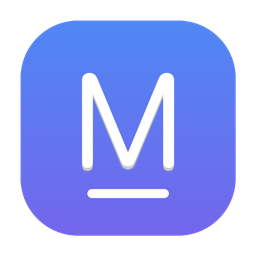

# MarkPad ⚡

> A lightweight, distraction-free Markdown editor for macOS — WYSIWYG editing meets powerful navigation and never-lose-your-work safety.
>
> 一款轻快专注的 macOS Markdown 编辑器 — 所见即所得 + 强大导航 + 永不丢稿。


**English** · [简体中文](README.zh-CN.md)

<p align="center">
  
</p>

---

## ✨ Features

### ✍️ Writing Experience

- **WYSIWYG editing** — type Markdown, see it rendered instantly (Vditor IR mode, just like Typora)
- **Focus mode** (⌘⇧F) — dims everything except the current paragraph, zero distractions
- **Typewriter mode** (⌘⇧T) — keeps the cursor vertically centered for long writing sessions
- **Rich content** — headings, bold/italic/strikethrough/highlight, lists, blockquotes, tables, code with line numbers, KaTeX math, task lists, footnotes, auto-generated `[toc]`

### 🧭 Navigation & File Management

- **Outline tree** (⌘\) — multi-level collapsible sidebar with persistent fold state; click any heading to jump with visual feedback (toast + flash highlight)
- **File manager panel** — three zones in one sidebar: ⭐ Favorites · 🕐 Recent (up to 20) · 📂 Current Folder; collapsible sections with keyword search
- **Quick Open** (⌘P) — fuzzy-search across favorites & recent files; keyboard-navigable results
- **Favorites** (⌘D) — star frequently-used files for instant access; one-click toggle
- **Document search** (⌘F) — find in document with real-time highlighting, prev/next navigation, match counter

### 🛡️ Never Lose Your Work

- **Auto-save** — saves to disk 1.5 s after you stop typing; status bar shows timestamp
- **Version history** — each auto-save creates a snapshot (up to 10 per file); browse, preview, restore, or copy any version
- **Draft recovery** — unsaved documents are backed up as drafts; next launch shows a recovery banner
- **Close confirmation** — native macOS dialog when closing with unsaved changes (Save / Don't Save / Cancel)

### 🎨 Themes & Layout

- **Appearance mode** — Light · Dark · Follow System (⌘/ cycles); syncs with macOS in real time
- **5 style presets** — Default · GitHub · Night · Sepia (warm paper) · Slate (⌘⇧/ cycles); each auto-adjusts the light/dark base
- **Three-column layout** — Outline ↔ Editor ↔ Source; drag any divider to resize
- **Source panel** (⌘E) — side-by-side rendered view + raw Markdown with bidirectional sync; edit either side

### 🖼️ Images & Extended Syntax

- **Image drag & paste** — drop or paste images into the editor; they auto-save to an `assets/` folder beside your document
- **Extended Markdown** — `==highlight==` · `[^1]` footnotes · `[toc]` directory · CJK auto-spacing · term auto-correction
- **Code line numbers** — syntax-highlighted code blocks show line numbers on the left

### 🍎 macOS Integration

- **Drag & drop to open** — drag `.md` files onto the window, Dock icon, or even onto a closed app
- **File association** — registered handler for `.md` `.markdown` `.mdown` `.mkd` `.mdtext` `.txt`; set MarkPad as your default editor in Finder
- **Native feel** — inset traffic lights, document-dirty dot, recent files menu, word count in status bar
- **Privacy-aware** — won't trigger macOS "access Desktop/Downloads" permission dialogs on first use

---

## 📦 Install

Download the latest `.dmg` from the [Releases](https://github.com/SirKayZh/markpad/releases) page:

- Apple Silicon (M1/M2/M3/M4…): `MarkPad-1.6.3-arm64.dmg`
- Intel: `MarkPad-1.6.3-x64.dmg`

> The app is **not code-signed / notarized**. On first launch, right-click the app → **Open**, or run:
> ```bash
> xattr -cr /Applications/MarkPad.app
> ```

### Set as Default Markdown Editor

After installing, right-click any `.md` file in Finder → **Open With** → choose **MarkPad**. To make it permanent, select **Always Open With** or set it in **Get Info**.

---

## ⌨️ Keyboard Shortcuts

| Action | Shortcut |
| --- | --- |
| New | ⌘N |
| Open | ⌘O |
| Quick Open | ⌘P |
| Save | ⌘S |
| Save As | ⌘⇧S |
| Toggle Favorite | ⌘D |
| Find in Document | ⌘F |
| Toggle Outline | ⌘\ |
| Toggle Source Panel | ⌘E |
| Focus Mode | ⌘⇧F |
| Typewriter Mode | ⌘⇧T |
| Cycle Appearance (Light → Dark → System) | ⌘/ |
| Cycle Style Theme | ⌘⇧/ |

---

## 🛠 Development

```bash
git clone https://github.com/SirKayZh/markpad.git
cd markpad
npm install
npm start            # launch dev
MARKPAD_DEBUG=1 npm start  # with DevTools
```

### Build DMG

```bash
npm run dmg            # build current version → release/
npm run release:patch  # bump patch + build + commit + tag
npm run release:minor  # bump minor + build + commit + tag
npm run release:major  # bump major + build + commit + tag
```

> Note: on Apple Silicon, `electron-builder`'s internal `hdiutil` DMG step may fail due to macOS sandbox restrictions on auto-mounting volumes. The project's build script uses `hdiutil makehybrid` + `convert` as a workaround.

---

## 🧱 Tech Stack

- **[Electron](https://www.electronjs.org/) 31** — desktop shell
- **[Vditor](https://github.com/Vanessa219/vditor) 3** — Markdown IR (instant rendering) engine
- Main process `main.js` (menu / file IO / auto-save / version snapshots) + `preload.js` (secure contextBridge IPC) + `src/` (UI)

---

## 🤝 Contributing

Issues and PRs are welcome! Ideas for the roadmap:

- [ ] Multiple tabs / windows
- [ ] Custom CSS themes
- [ ] PDF export
- [ ] Vim key bindings

---

## 📄 License

[MIT](LICENSE) © 2026 MarkPad Contributors
