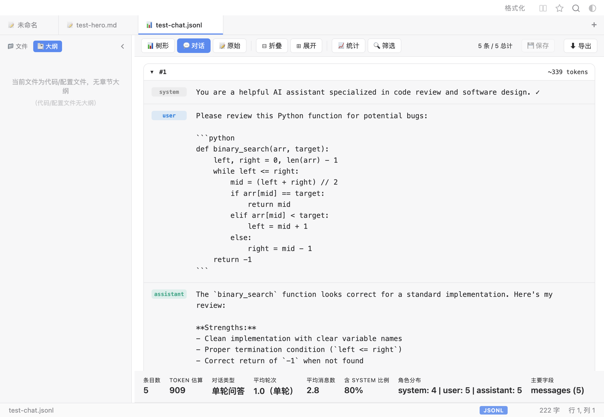
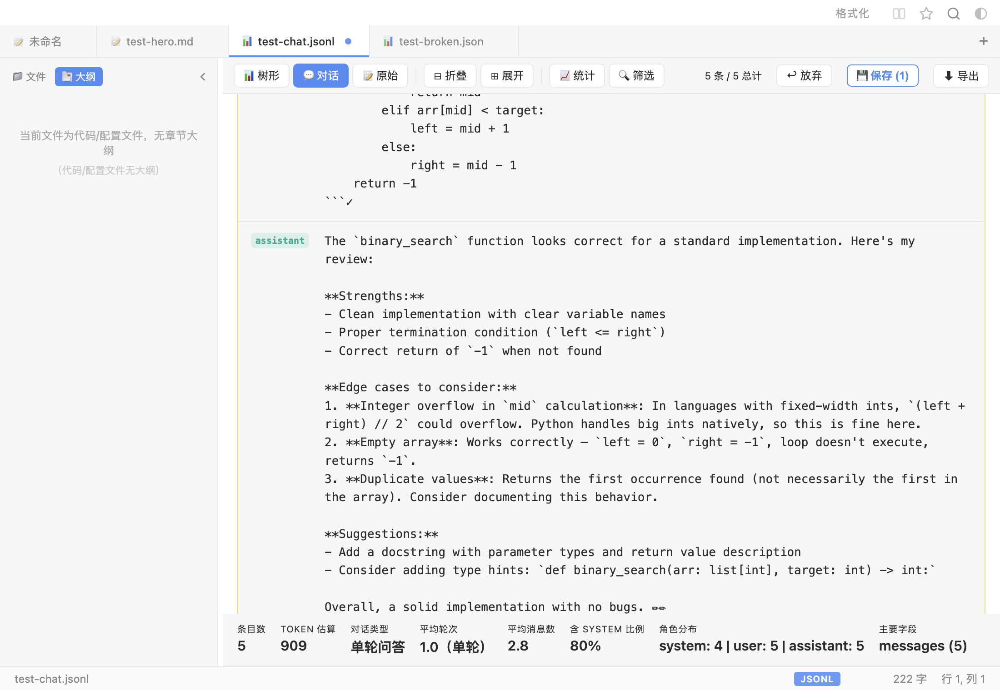
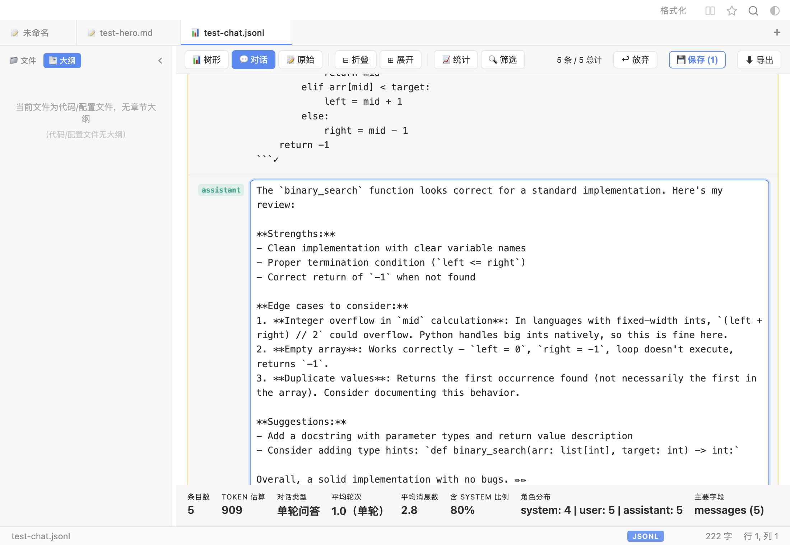
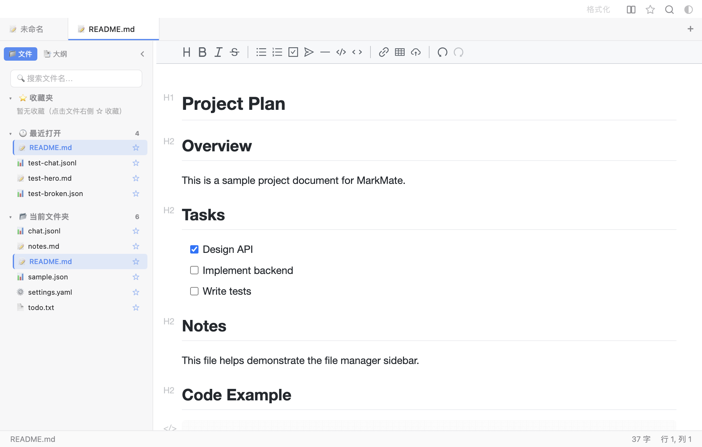
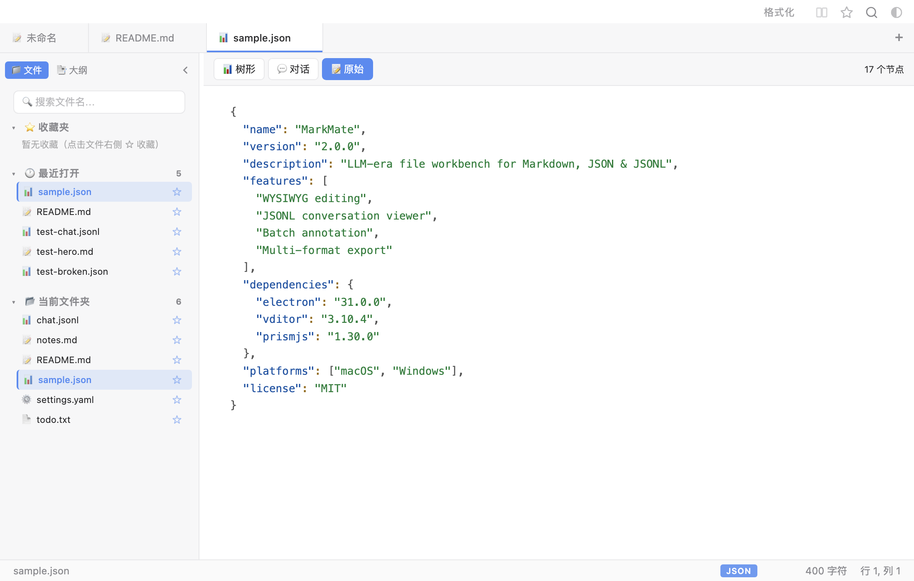
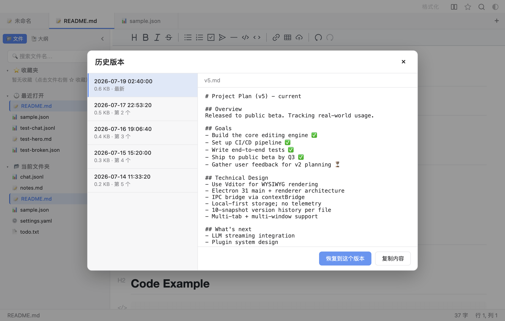
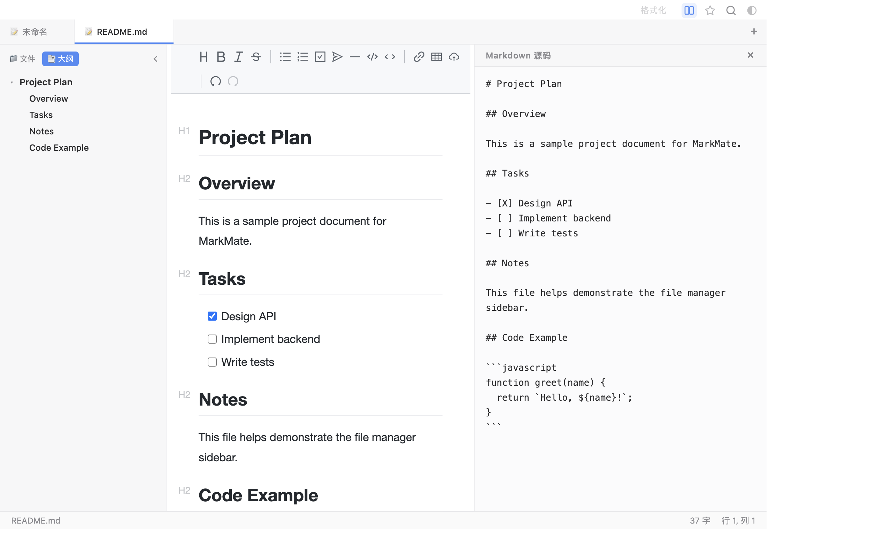

# MarkMate ⚡

> **你的 AI 文件，不该只用文本编辑器打开。** MarkMate 是为大模型工作流量身打造的**桌面文件编辑器**——一个应用搞定你每天面对的三类核心文件：**Markdown**（写作、文档、Prompt）、**JSON**（配置、输出结果）和 **JSONL**（训练数据、日志）。所见即所得编辑、对话气泡浏览、一键格式化、批量标注、多格式导出 —— 本地运行、界面精美。macOS & Windows 双平台。
>
> **Your AI files deserve better than a text editor.** MarkMate is the LLM-era file workbench — one clean app for Markdown, JSON, and JSONL. WYSIWYG editing, conversation bubbles, one-click formatting, batch annotation, and multi-format export — all local-first.


[English](README.md) · **简体中文** · [🌐 文档站](https://sirkyzh.github.io/markmate)

<p align="center">
  
</p>

<p align="center">
  <a href="https://github.com/SirKayZh/markmate/releases"></a>
  &nbsp;
  <a href="https://github.com/SirKayZh/markmate/issues/new"></a>
  &nbsp;
  <a href="https://sirkyzh.github.io/markmate/feedback"></a>
</p>

---

### 🎯 一个编辑器，三类文件通吃

<p align="center">
  &nbsp;
  
</p>

<p align="center">
  <em>写漂亮的 Markdown（左）· 用对话气泡看 JSONL 数据集（右）</em>
</p>

<p align="center">
  &nbsp;
  
</p>

<p align="center">
  <em>精确定位修复 JSON 错误（左）· 批量标注训练数据（右）</em>
</p>

---

## ✨ 为什么选 MarkMate？

MarkMate 为**现代 AI 工作流**而生。你不再只是写文档——你还要浏览数据集、修复 JSON 错误、标注训练数据、导出分享。大多数工具让你在 3-4 个应用之间来回切换，MarkMate 一个就够了。

| | **MarkMate** | **Typora** | **VS Code** |
|---|:---:|:---:|:---:|
| **价格** | ✅ 免费开源 | ❌ $14.99 | ✅ 免费 |
| **所见即所得 Markdown** | ✅ 即时渲染 | ✅ 即时渲染 | ❌ 预览分离 |
| **macOS + Windows** | ✅ 双平台 | ✅ 双平台 | ✅ 双平台 |
| **JSONL 数据集查看器** | ✅ 对话气泡 + 统计 | ❌ 无 | ❌ |
| **JSON / YAML / XML 编辑器** | ✅ 语法高亮 + 格式化 | ❌ 无 | ✅ |
| **批量标注编辑** | ✅ 行内编辑 + 批量保存 | ❌ 无 | ❌ |
| **PDF / HTML / Word / PNG 导出** | ✅ 一键导出 | ✅ | ❌ 需插件 |
| **版本快照** | ✅ 每文件 10 个 | ❌ 无 | ✅ (需 Git) |
| **内置文件管理** | ✅ 收藏/最近/文件夹 | ❌ 无 | ✅ 资源管理器 |
| **自动升级** | ✅ 内置 | ❌ | ❌ |
| **隐私（本地优先）** | ✅ 不上传 | ✅ | ✅ |
| **开源** | ✅ MIT | ❌ 闭源 | ✅ MIT |
| **启动速度** | ✅ 快 | ✅ 快 | ❌ 较慢 |

---

## ✨ 功能特性

### ✍️ Markdown 写作

- **所见即所得**：边写 Markdown 边即时渲染（Vditor IR 即时渲染模式，体验如 Typora）
- **专注模式**（⌘⇧F）：只高亮当前段落，其余内容自动变暗，零干扰沉浸写作
- **打字机模式**（⌘⇧T）：光标始终保持在屏幕中央，长时间写作更舒适
- **丰富内容**：标题、粗体/斜体/删除线/高亮、列表、引用、表格、代码高亮（带行号）、KaTeX 数学公式、任务清单、脚注、自动目录 `[toc]`
- **5 套排版主题**：默认 · GitHub · Night · Sepia（护眼米黄）· Slate（⌘⇧/ 循环）；自动切换对应亮暗基础模式
- **三栏可拖动布局**：大纲 ↔ 编辑器 ↔ 源码，拖动分隔条自由调整宽度
- **源码面板**（⌘E）：渲染视图 + Markdown 源码并排，**双向滚动同步**
- **大纲树**（⌘\）：多级缩进，折叠状态记忆；随滚动自动高亮；点击跳转带 toast + 闪烁反馈

### 📂 文件管理

- **文件管理面板**：侧栏三区合一 — ⭐ 收藏夹 · 🕐 最近打开（最多 10 个）· 📂 当前文件夹；各分区可折叠，支持关键词搜索
- **快速打开**（⌘P）：模糊搜索收藏与最近文件，键盘导航
- **收藏**（⌘D）：一键收藏常用文件，星标切换
- **智能文件列表**：当前文件夹显示所有文件（不限于 `.md`）；右键文件夹打开 Finder
- **文档内搜索**（⌘F）：实时高亮所有匹配，上/下一个跳转，显示匹配计数

<p align="center">
  
</p>

### 🧠 JSONL 数据集查看与编辑

- **对话气泡渲染**：自动识别 OpenAI Messages、Alpaca、ShareGPT 三种格式；角色着色气泡（`system` 灰色 · `user` 蓝色 · `assistant` 绿色 · `tool` 黄色）
- **数据集统计**：一眼看清总轮次、角色分布、Token 估算
- **行内标注编辑**：点击任意气泡直接修改；改过的条目标记黄色「已改」；「💾 保存(N)」一键整文件回写
- **保存并下一页**：标完一页存盘自动翻页，适合批量标注工作流
- **JSON 解析错误定位**：格式错误的 JSON 文件不再静默失败——红色错误条标出行号、列号与原因，点「定位」一键跳转

### 💻 JSON / YAML / XML 查看与编辑

- **语法高亮**：Prism.js 着色，亮/暗双主题独立配色
- **一键格式化**：⌥⌘L 美化 JSON/JSONL/XML 缩进
- **文件类型图标**：按格式显示不同 emoji 徽标（📝 .md · 📊 .json · 📋 .xml · ⚙️ .yml/.yaml）
- **零开销**：磁盘上仍是纯净的 `.json` / `.xml` / `.yaml` 文件，无任何额外标记

<p align="center">
  
</p>

### 🛡️ 永不丢稿

- **自动保存**：停止输入 1.5 秒后自动落盘，状态栏实时显示
- **历史版本**：每次自动保存打快照（每文件最多 10 个），可浏览、预览、一键恢复或复制
- **草稿恢复**：未命名文档意外退出后下次启动自动弹出恢复提示
- **关闭确认**：有未保存改动时弹出原生对话框（保存 / 不保存 / 取消）

<p align="center">
  
</p>

### 📤 多格式导出

- **PDF**（⌘⇧P）：跨页排版优化，零外部依赖
- **HTML**：单文件含完整样式
- **Word（.docx）**：Word/Pages/WPS 直接打开
- **长图（PNG）**：2 倍精度截屏，社群分享神器

<p align="center">
  
</p>

### 🍎 macOS 深度集成（Windows 也可用）

- **拖拽打开**：文件拖到窗口 / Dock 图标 / 未启动应用上均可打开
- **文件关联**：已注册 `.md` `.json` `.jsonl` `.yml` `.yaml` `.xml` `.txt`；可在 Finder 中设为默认编辑器
- **原生体验**：内嵌红绿灯按钮、文档修改标记、最近打开菜单、状态栏字数统计
- **自动升级**：内置版本检测（GitHub Releases）；一键下载 + 重启安装（v2.0.0+）

---

## 📦 安装

从 [Releases](https://github.com/SirKayZh/markmate/releases) 页面下载最新版本：

**macOS：**
- Apple 芯片（M1/M2/M3/M4…）：`MarkMate-2.1.0-arm64.dmg`
- Intel：`MarkMate-2.1.0-x64.dmg`

**Windows：**
- `MarkMate-2.1.0-x64-setup.exe` — 安装版（推荐）
- `MarkMate-2.1.0-x64-portable.exe` — 便携版，解压即用

> 两个平台的应用均**未经过代码签名/公证**。
>
> **macOS**：右键点击应用 → **打开**，或运行 `xattr -cr /Applications/MarkMate.app`
>
> **Windows**：SmartScreen 弹出时点击 **更多信息** → **仍要运行**

### 设为默认编辑器

**macOS**：右键 `.md` → **打开方式** → **MarkMate** → **始终以此方式打开**。

**Windows**：右键 `.md` → **打开方式** → **MarkMate** → **始终使用此应用**。

---

## ⌨️ 快捷键

| 操作 | macOS | Windows |
| --- | --- | --- |
| 新建 | ⌘N | Ctrl+N |
| 打开 | ⌘O | Ctrl+O |
| 快速打开 | ⌘P | Ctrl+P |
| 保存 | ⌘S | Ctrl+S |
| 另存为 | ⌘⇧S | Ctrl+⇧S |
| 收藏当前文件 | ⌘D | Ctrl+D |
| 文档内搜索 | ⌘F | Ctrl+F |
| 切换大纲 | ⌘\ | Ctrl+\ |
| 切换源码面板 | ⌘E | Ctrl+E |
| 专注模式 | ⌘⇧F | Ctrl+⇧F |
| 打字机模式 | ⌘⇧T | Ctrl+⇧T |
| 导出 PDF | ⌘⇧P | Ctrl+⇧P |
| 循环外观 | ⌘/ | Ctrl+/ |
| 循环排版主题 | ⌘⇧/ | Ctrl+⇧/ |

---

## 🛠 开发

```bash
git clone https://github.com/SirKayZh/markmate.git
cd markmate
npm install
npm start            # 启动开发
MARKMATE_DEBUG=1 npm start  # 启动并打开 DevTools
```

### 打包

```bash
npm run dmg            # 打 macOS DMG → release/
npm run win            # 打 Windows（安装版 + 便携版）→ release/
npm run release:patch  # bump 版本 + 打包 + 提交 + 打 tag
npm run release:minor  # 新增功能
npm run release:major  # 破坏性改动
```

> **macOS 注意**：在 Apple 芯片上，`electron-builder` 内部的 `hdiutil` 打 DMG 步骤可能因 macOS 沙箱限制失败。本项目的打包脚本改用 `hdiutil makehybrid` + `convert` 绕开该限制。Windows 打包可在 macOS 上交叉编译（electron-builder 自动下载 Wine + NSIS）。

---

## 🧱 技术栈

- **[Electron](https://www.electronjs.org/) 31** —— 跨平台桌面外壳（macOS + Windows）
- **[Vditor](https://github.com/Vanessa219/vditor) 3** —— Markdown IR（即时渲染）引擎
- `main.js`（菜单 / 文件 IO / 自动保存 / 版本快照）+ `preload.js`（contextBridge IPC）+ `src/`（界面）

---

## 🔒 隐私保护

MarkMate 是一款**本地优先**的编辑器 —— 你的文档永远不会离开你的电脑。

- 绝不收集、不上传、不存储任何文档内容。
- 当前版本无埋点、无分析、无追踪。
- 未来版本可能会在**明确征得你同意**的情况下匿名上报聚合使用数据，首次启动时弹窗说明，可随时拒绝或关闭。
- 完整隐私政策：[sirkyzh.github.io/markmate/privacy](https://sirkyzh.github.io/markmate/privacy)

## 💬 反馈与交流

- 🐛 [提交 Bug / 功能建议](https://github.com/SirKayZh/markmate/issues/new)
- 📝 [填写反馈问卷](https://sirkyzh.github.io/markmate/feedback)
- 💡 [参与功能讨论](https://github.com/SirKayZh/markmate/discussions)
- 🌐 [访问文档站点](https://sirkyzh.github.io/markmate)

---

## 🤝 参与贡献

欢迎提交 Issue 和 PR！路线图设想：

- [x] 多标签页 / 多窗口（v1.6.0）
- [ ] 自定义 CSS 主题
- [x] PDF / HTML / Word / 长图 导出（v1.4.0）
- [x] Windows 支持（v1.4.1）
- [x] 代码/配置文件查看与语法高亮（v1.5.0）
- [x] JSONL 数据集查看器（对话气泡）（v2.0.0）
- [x] JSONL 行内标注编辑（v2.0.0）
- [x] GitHub Releases 自动升级（v2.0.0）
- [ ] Vim 键绑定

---

## 📄 许可证

[MIT](LICENSE) © 2026 MarkMate Contributors
